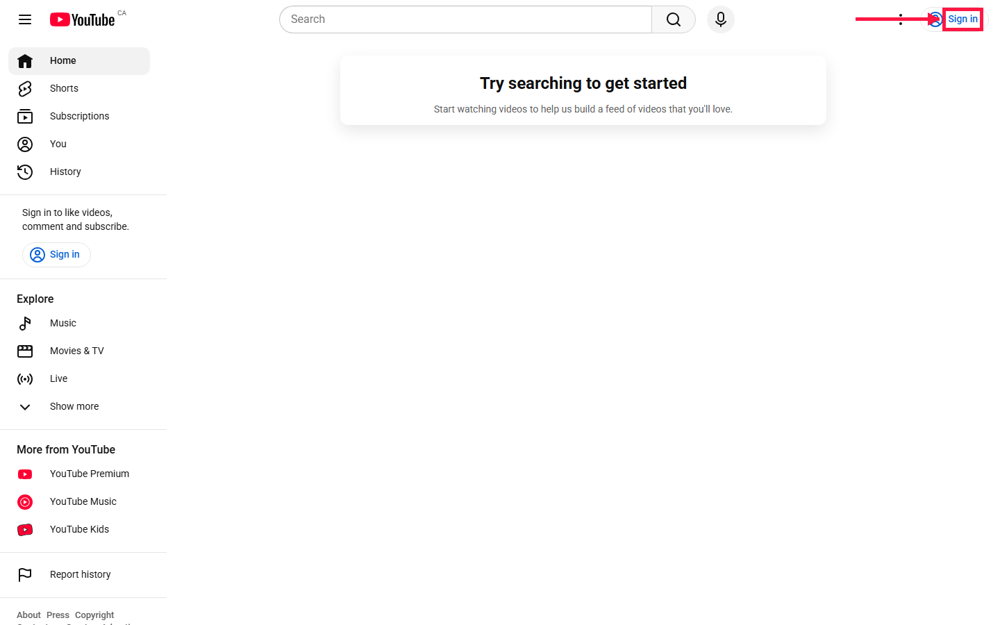

# pinpoint-mcp

> MCP server for screenshot capture + intelligent visual annotation. Built for Claude Desktop, Claude Code, and any MCP-compatible client.

**The problem.** Claude sees a screen and tells you *"click the button in the top-right, near the gear icon..."* in words. You hunt for it, lose 30 seconds, sometimes click the wrong thing.

**The fix.** Claude sees the screen → finds the exact element via OCR or DOM → returns an annotated screenshot with a red box + arrow pointing at the precise spot.

## Demo

*"Show me where to sign in on YouTube."*

<p align="center">
  
</p>

One call:

```python
pinpoint_show_me(
    source="https://www.youtube.com",
    target="Sign in",
)
```

Pinpoint loaded the page in headless Chromium, matched the DOM selector
`text=Sign in`, and returned the annotated PNG above — red box + arrow on
the exact click target, top-right of the page.

**👉 Live install walkthrough: [hlsitechio.github.io/pinpoint-mcp/install.html](https://hlsitechio.github.io/pinpoint-mcp/install.html)**

## Architecture

```
┌─────────────────────────────────────────────────────┐
│  Claude (Desktop / Code / any MCP client)           │
└──────────────────────┬──────────────────────────────┘
                       │ MCP stdio
                       ▼
┌─────────────────────────────────────────────────────┐
│  pinpoint-mcp                                       │
│  ├── capture/                                       │
│  │   ├── screen.py   -> mss (Windows/Linux/macOS)   │
│  │   └── web.py      -> Playwright (CDP)            │
│  ├── detect/                                        │
│  │   └── ocr.py      -> Tesseract                   │
│  └── render/                                        │
│      └── annotate.py -> Pillow                      │
└─────────────────────────────────────────────────────┘
```

## Installation

👉 **Visual walkthrough**: [hlsitechio.github.io/pinpoint-mcp/install.html](https://hlsitechio.github.io/pinpoint-mcp/install.html) — 6-slide HTML slideshow with annotated screenshots, hosted via GitHub Pages.

### 1. Prerequisites

- Python 3.11+
- Tesseract OCR
  - **Windows** : [install from UB Mannheim](https://github.com/UB-Mannheim/tesseract/wiki) (include the language packs you need)
  - **Debian/Kali** : `sudo apt install tesseract-ocr tesseract-ocr-eng`
  - **macOS** : `brew install tesseract tesseract-lang`

### 2. Install the package

```powershell
# Windows
pip install -e .
playwright install chromium
```

```bash
# Linux / macOS
pip install -e .
playwright install chromium
```

### 3. Configure Claude Desktop

Edit `%APPDATA%\Claude\claude_desktop_config.json` (Windows) or
`~/Library/Application Support/Claude/claude_desktop_config.json` (macOS):

```json
{
  "mcpServers": {
    "pinpoint": {
      "command": "python",
      "args": ["-m", "pinpoint.server"],
      "env": {
        "PINPOINT_WORKDIR": "C:\\Users\\YOU\\pinpoint-output"
      }
    }
  }
}
```

Restart Claude Desktop. The server appears in the MCP panel.

## Exposed tools

| Tool | Description |
|------|-------------|
| `pinpoint_list_monitors` | List available displays |
| `pinpoint_capture_screen` | Full-screen screenshot (per monitor) |
| `pinpoint_capture_active_window` | Screenshot of the active window (Windows) |
| `pinpoint_capture_url` | Screenshot of a web page (Playwright) |
| `pinpoint_find_text` | Locate text via Tesseract OCR |
| `pinpoint_find_web_element` | Locate a DOM element via Playwright selectors |
| `pinpoint_annotate` | Draw rectangles / arrows / numbered steps / highlights / blurs |
| `pinpoint_show_me` | **★ One-call workflow: capture + detect + annotate** |
| `pinpoint_make_tutorial` | Multi-step annotated walkthrough from a single source image |

## Example usage with Claude

> **You**: *"Here's a screenshot of the Shopify admin — show me where to click to approve the scopes."*

> **Claude**:
> ```
> [calls pinpoint_show_me(target="Approve scopes",
>                         source="C:/screenshots/shopify.png")]
> ```
> Here's the annotated image — the button to click is boxed in red.

## Environment variables

| Variable | Default | Description |
|----------|---------|-------------|
| `PINPOINT_WORKDIR` | `%TEMP%/pinpoint` | Output directory for generated PNGs |
| `PINPOINT_TRANSPORT` | `stdio` | `stdio` or `http` |
| `PINPOINT_PORT` | `8765` | HTTP port when transport=http |

## Quick tests

```bash
# Check that Tesseract finds a target string in an image
python -c "from pinpoint.detect.ocr import OCRDetector; \
           print(OCRDetector().find_text('test.png', 'Approve scopes'))"

# List available monitors
python -c "from pinpoint.capture.screen import ScreenCapture; \
           [print(m.label) for m in ScreenCapture().list_monitors()]"
```

## Roadmap

- [ ] OCR: region-scoped search (search only inside a rectangle of the image)
- [ ] DOM: richer semantic selectors (ARIA tree introspection)
- [ ] Vision fallback via Claude API when OCR misses
- [ ] Citrix / RDP window support (capture by window handle)
- [ ] Animated GIF output for `pinpoint_make_tutorial`

## License

MIT — do whatever you want with it.

Built by [Hubert (rainkode)](https://crowbyte.io) for HLSI Tech.
